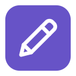

<p align="center">
  
</p>

<h1 align="center">Tinydash</h1>

<p align="center">
  Your day, one click away.<br>
  A compact macOS menu bar app for your calendar, tasks, email, and Slack.
</p>

<p align="center">
  <a href="#features">Features</a> ·
  <a href="#installation">Installation</a> ·
  <a href="#connections">Connections</a> ·
  <a href="#development">Development</a>
</p>

---

Tinydash brings your daily workspace into a small panel in the macOS menu bar. Check your next meeting, capture a task, and catch up on messages without opening each app.

## Features

- **Daily agenda** — today's Google Calendar events, upcoming meetings, and quick links to join calls.
- **Tasks and reminders** — create tasks, add optional due dates, and track completion.
- **Unread email** — recent Gmail conversations with sender details and message previews.
- **Slack overview** — direct messages and channel mentions, with local “seen” markers.
- **Quick navigation** — switch between Overview, Agenda, Tasks, Inbox, and Slack.
- **Light and dark appearance** — follows your Mac's appearance settings.
- **Daily sync** — refreshes automatically each day, with **Sync all** available anytime.

## Installation

### Requirements

- A Mac with Apple's Command Line Tools, including the Swift compiler.
- Your own Google OAuth credentials and Slack user token to enable those connections. Local tasks work independently.

Install the Command Line Tools if needed:

```sh
xcode-select --install
```

Clone the repository, then build and install the app:

```sh
git clone https://github.com/polodealvarado/tinydash.git
cd tinydash/macos-app
./build.sh
```

The script builds **Tinydash.app**, installs it in `/Applications`, and launches it. Click the pencil in your menu bar to open the dashboard.

## Connections

Open **Settings** using the gear button in the dashboard.

| Connection | What you need | What it provides |
| --- | --- | --- |
| Google | A desktop OAuth client with the Google Calendar and Gmail APIs enabled | Calendar events and unread email, with read-only access |
| Slack | A Slack user token with the `search:read` scope | Direct messages and channel mentions |

For Google, enter your client ID and client secret, then complete sign-in in your browser. For Slack, enter your user token and save it. Workspace policies may require administrator approval for either integration.

Credentials are stored in the **macOS Keychain**. Tasks, cached results, and local completion markers are stored on your Mac. Calendar, email, and Slack links open in your default browser.

## Everyday use

1. Click the **pencil** in the menu bar to open Tinydash.
2. Use **Overview** for the full dashboard, or select a counter or section to focus on one area.
3. Add tasks with an optional due date, and mark items as done or seen as you work.
4. Choose **Sync all** whenever you want to refresh your connected services.

Right-click the menu bar icon for **Sync now**, **Open at login**, and **Quit Tinydash**.

## Development

Tinydash uses **Swift and AppKit** for the native app, with a bundled **HTML, CSS, and JavaScript** dashboard rendered in **WKWebView**. The native app handles API calls, authentication, and persistent storage.

### Build without installing

From the repository root:

```sh
./macos-app/build.sh --build-only
```

The app bundle is written to `macos-app/Tinydash.app`. Generated build files are excluded from version control.

### Project structure

```text
tinydash/
├── assets/                  Pencil artwork and project logo
├── dashboard/
│   └── index.html           Dashboard interface and interactions
├── macos-app/
│   ├── main.swift           Native app, integrations, and storage
│   ├── PencilIcon.swift     Shared pencil drawing
│   ├── generate-icon.swift Application icon generator
│   ├── Info.plist           App bundle metadata
│   └── build.sh             Build and installation script
└── docs/                    Technical documentation
```

## Feedback

Found a bug or have an idea? [Open an issue](https://github.com/polodealvarado/tinydash/issues) with the details. For visual issues, include a screenshot and your macOS version.
