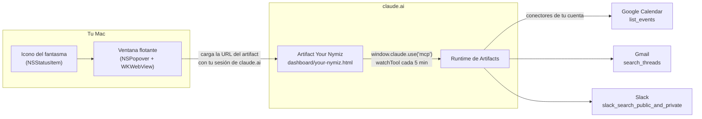

# Arquitectura

Your Nymiz tiene dos piezas independientes:

1. **El panel** (`dashboard/your-nymiz.html`): una página publicada como Artifact de claude.ai que lee tus datos en vivo.
2. **La app de la barra de menús** (`macos-app/`): una app de macOS que solo muestra ese panel en una ventana flotante.

La app no lee tus datos. Toda la lectura la hace el panel dentro de claude.ai con tu sesión.

## El panel

- **URL publicada:** https://example.com/dashboard (privado, solo lo ves tú).
- **Tecnología:** HTML, CSS y JavaScript sin librerías ni paso de compilación. Al publicar, claude.ai envuelve el archivo en `<html><head><body>`, así que el archivo no lleva esas etiquetas.
- **Tipografías:** Bricolage Grotesque (títulos), IBM Plex Sans (texto), IBM Plex Mono (horas y etiquetas), desde Google Fonts.
- **Tema:** colores como variables en `:root`, con paleta oscura automática (`prefers-color-scheme`) y respetando el tema elegido en claude.ai (`data-theme`).
- **Idioma de la interfaz:** inglés. Fechas y horas con `en-GB` (formato 24 h).

### Secciones

| Sección | Conector y herramienta | Qué pide |
|---|---|---|
| Today's agenda | Google Calendar → `list_events` | Eventos de hoy (00:00–24:00 de tu zona horaria), ordenados por hora |
| Unread email | Gmail → `search_threads` | `in:inbox is:unread newer_than:3d -category:promotions -category:social -category:forums`, máx. 25 |
| Slack · Direct messages | Slack → `slack_search_public_and_private` | `to:<@U00000000> after:<ayer>` (DMs y grupos de hoy), máx. 20 |
| Slack · Channel mentions | Slack → `slack_search_public_and_private` | palabra clave `<@U00000000>`, `after:<hace 3 días> -is:dm`, máx. 15 |

Además, arriba:

- **Now / Next:** la reunión en curso o la siguiente, con botón Join si tiene Meet.
- **Resumen:** eventos que quedan, invitaciones sin responder, correos sin leer y cosas por ver en Slack.

### Cómo llegan los datos

- `await window.claude.use("mcp")` devuelve el acceso a los conectores (o `null` si la vista no puede usarlos, por ejemplo al abrir el archivo en local).
- Cada sección registra un `watchTool(servidor, herramienta, entrada, handler, {refetchInterval: 300000})`: muestra lo último que tenía en caché, lo refresca y vuelve a pedirlo cada 5 minutos mientras la página está abierta.
- El botón Refresh llama a `mcp.invalidate(servidor)` para forzar una lectura nueva.
- Los errores se gestionan por sección y por código (`needs_reauth`, `server_not_connected`, falta de permisos, etc.) con un mensaje que dice cómo arreglarlo. Si una sección falla, las demás siguen funcionando.

### Formato real de las respuestas

Observado en llamadas reales el 23/09/2026. Si algo deja de salir, lo primero es comparar con esto.

- **Calendar:** `{events: [{id, summary, start: {dateTime | date}, end, htmlLink, conferenceUrl, conferenceData.videoEntryPoint.uri, attendees: [{self, responseStatus}]}]}`
- **Gmail:** `{threads: [{id, viewUrl, messages: [{subject, sender, snippet, date, labelIds, viewUrl}]}], resultCountEstimate}`. Los fragmentos traen entidades HTML (`&#39;`) y caracteres de relleno (U+034F). `cleanText()` los limpia.
- **Slack:** `{results: "<informe en markdown>"}`. **Es texto, no JSON.** `normSlack()` lo trocea por `### Result N of M` y lee las líneas `Channel:`, `Participants:`, `From:`, `Message_ts:`, `Permalink: [link](url)` y el bloque `Text:` hasta `---`. Las menciones `<@U…|Nombre>` se convierten en `@Nombre`.

### Estado guardado en el navegador

Solo en `localStorage` de ese navegador, envuelto en try/catch. No se sincroniza entre dispositivos.

| Clave | Qué guarda | Duración |
|---|---|---|
| `radar-done-<fecha>` | Eventos y correos marcados como hechos (casilla) | Solo ese día |
| `radar-slack-seen` | Mensajes de Slack marcados como vistos (botón verde) | Se purgan a los 7 días |

En Slack, cada conversación de DM se identifica por su último mensaje. Si alguien vuelve a escribir, la conversación reaparece.

### Código sin usar

`renderDrive()` y `normFiles()` son restos de la sección de Drive que se quitó. No se llaman y se pueden borrar.

## La app de la barra de menús

- **Lenguaje:** Swift, un solo archivo (`main.swift`), AppKit + WebKit + ServiceManagement. Sin Xcode: se compila con `swiftc` desde `build.sh`.
- **Bundle:** `Your Nymiz.app`, id `com.nymiz.yournymiz`, `LSUIElement` (sin icono en el Dock), firma ad hoc.
- **Icono:** `makeStatusIcon()` dibuja el fantasma de `assets/ghost.svg` como imagen plantilla de 18×18; macOS lo tiñe según la barra.
- **Ventana:** `NSPopover` de 460×680 con un `WKWebView` que usa el almacén de datos persistente (la sesión se queda guardada) y un user agent de Safari.
- **Clic izquierdo:** abre o cierra el panel. **Clic derecho:** Refresh, Open in browser, Diagnostics…, Open at login (macOS 13+), Quit.
- **Enlaces:** los de hosts que no son claude.ai, anthropic.com, claudeusercontent.com o accounts.google.com se abren en el navegador por defecto.
- **Inicio de sesión:** la ventanita de Google se abre como ventana real (`createWebViewWith` con la configuración que pasa WebKit) para que pueda avisar a claude.ai al terminar. Mientras inicias sesión, el panel no se cierra al pulsar fuera. Al terminar, vuelve solo al panel.
- **Diagnóstico:** superposición con indicador de carga y errores, aviso si la página se queda vacía, y la opción Diagnostics… con la URL, el estado de carga, la longitud del texto de la página y el último error (con botón Copy). El inspector web está activado (macOS 13.3+).
