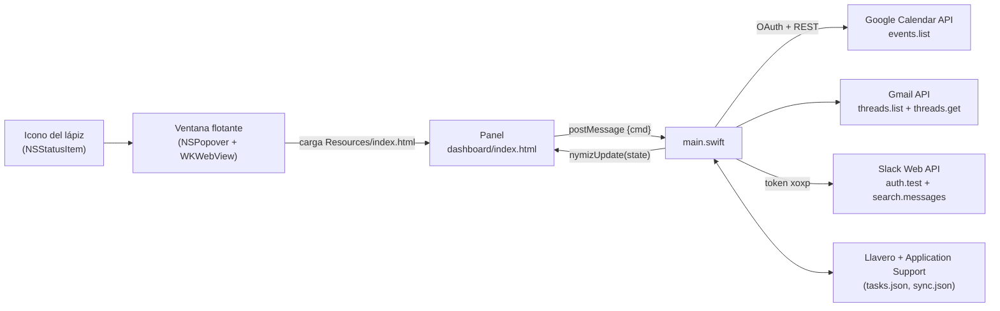

# Arquitectura (v2)

Una sola app de macOS. Ya no depende de claude.ai: la app pide los datos a Google y Slack y se los pasa a un panel HTML local.

## Puente panel ↔ app

- **Del panel a la app:** `window.webkit.messageHandlers.nymiz.postMessage({cmd, …})` con `ready`, `sync`, `saveTasks {tasks}`, `setPeriod {days}`, `connectGoogle {clientId, clientSecret}`, `setSlackToken {token}` y `disconnect {which}`.
- **De la app al panel:** `window.nymizUpdate(state)` con `{google, slack, syncing, tasks, sync, periodDays}`. `sync` lleva `{at, periodDays, cal, mail, slackDm, slackMen, me, err:{google, slack}}`, con las respuestas en bruto de las APIs. El panel las normaliza en `normEvents`, `normThreads` y `normSlack`. El periodo del último resultado se conserva para no etiquetar datos antiguos como si ya se hubieran vuelto a consultar.

## Secciones

| Sección | Llamada | Qué pide |
|---|---|---|
| Agenda | `calendar/v3/calendars/primary/events` | Solo hoy, límites de medianoche local, `singleEvents`, ordenado por hora, máx. 50 |
| Tasks | — (local) | `{id, text, due, done, created}` en `tasks.json` |
| Unread email | `gmail/v1/users/me/threads` + `threads/{id}?format=metadata` | `in:inbox is:unread after:<inicio en segundos> before:<fin en segundos> -category:promotions -category:social -category:forums`, máx. 25 |
| Slack · DMs | `search.messages` | `to:<@ME> after:<hace N días>` (límite exclusivo), máx. 20 |
| Slack · Mentions | `search.messages` | `<@ME> -is:dm after:<hace N días>`, máx. 15 |

`ME` se obtiene con `auth.test`; tus propios mensajes se filtran.

## Sincronización

La agenda es independiente de `periodDays`: la consulta nativa abarca hoy y `todayEvents(now)` filtra de nuevo los resultados en el panel, incluidos los de cachés antiguas. Solo pasan los eventos que se solapan con el día local actual; el final de los eventos es exclusivo. `pendingEvents()` usa esa misma lista para los contadores y Now/Next. El campo `agendaDay` de la caché fuerza una actualización al arrancar si falta o pertenece a otro día.

Los indicadores de pendientes comparten el mismo criterio: agenda usa `pendingEvents()` (sin marca de hecho y sin haber terminado por horario), correo usa `pendingMail()` (sin marca de hecho), tareas usa `openTasks()` y Slack usa `slackPending()`. Agenda aplica ese criterio también a Now/Next y al resumen de invitaciones sin responder. Las marcas de agenda y correo son locales y diarias; no modifican Calendar ni el estado de lectura en Gmail. Las filas completadas permanecen visibles para poder deshacerlas. En correo, el total estimado de Gmail se presenta aparte del contador local de pendientes.

Una vez al día (ver `docs/CONFIGURACION.md`) y con **Sync all**. Cada sincronización sustituye entera la anterior: si una fuente falla, su sección muestra el error en vez de datos viejos. Si la página se cargó otro día, la app la recarga al sincronizar para que "hoy" avance.

`periodDays` vale 5 por defecto y se guarda en `UserDefaults`; Swift y el formulario validan el rango 1–365. Guardar el periodo inicia una sincronización. Si hay una en curso, la siguiente queda en cola. Al arrancar, una caché sin periodo o con otro valor se actualiza aunque se haya sincronizado ese día. Gmail utiliza [límites de fecha en segundos](https://developers.google.com/workspace/gmail/api/guides/filtering) para respetar la zona horaria local. Las tareas se filtran localmente por vencimiento o creación, con **Show all** para verlas todas.

## Editor de tareas

El editor de tareas es un `textarea` con crecimiento automático, redimensionado vertical y botón Expand/Compact. El texto se sigue escapando antes de renderizarlo; `white-space: pre-wrap` conserva los saltos de línea. Texto y fecha del borrador se guardan en `localStorage` con la clave `tinydash-task-draft`, sin añadirlos a la sincronización ni al repositorio.

## Identidad de Tinydash

Desde v2.2, `Tinydash.app` usa un lápiz como icono en la barra y en el panel. `PencilIcon.swift` comparte el dibujo entre la imagen de la barra y el icono de la app generado por `generate-icon.swift`.

Se mantienen `com.nymiz.yournymiz`, la carpeta `Application Support/YourNymiz`, los nombres del puente y las claves de `localStorage` para conservar la compatibilidad con Your Nymiz.
