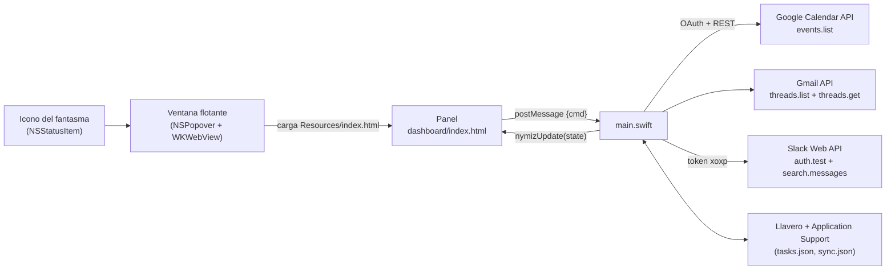

# Arquitectura (v2)

Una sola app de macOS. Ya no depende de claude.ai: la app pide los datos a Google y Slack y se los pasa a un panel HTML local.

## Puente panel ↔ app

- **Del panel a la app:** `window.webkit.messageHandlers.nymiz.postMessage({cmd, …})` con `ready`, `sync`, `saveTasks {tasks}`, `connectGoogle {clientId, clientSecret}`, `setSlackToken {token}` y `disconnect {which}`.
- **De la app al panel:** `window.nymizUpdate(state)` con `{google, slack, syncing, tasks, sync}`. `sync` lleva `{at, cal, mail, slackDm, slackMen, me, err:{google, slack}}`, con las respuestas en bruto de las APIs. El panel las normaliza en `normEvents`, `normThreads` y `normSlack`.

## Secciones

| Sección | Llamada | Qué pide |
|---|---|---|
| Today's agenda | `calendar/v3/calendars/primary/events` | De 00:00 a 24:00 de hoy, `singleEvents`, ordenado por hora |
| Tasks | — (local) | `{id, text, due, done, created}` en `tasks.json` |
| Unread email | `gmail/v1/users/me/threads` + `threads/{id}?format=metadata` | `in:inbox is:unread newer_than:3d -category:promotions -category:social -category:forums`, máx. 25 |
| Slack · DMs | `search.messages` | `to:<@ME> after:<ayer>` (hoy), máx. 20 |
| Slack · Mentions | `search.messages` | `<@ME> -is:dm after:<hace 3 días>`, máx. 15 |

`ME` se obtiene con `auth.test`; tus propios mensajes se filtran.

## Sincronización

Una vez al día (ver `docs/CONFIGURACION.md`) y con **Sync all**. Cada sincronización sustituye entera la anterior: si una fuente falla, su sección muestra el error en vez de datos viejos. Si la página se cargó otro día, la app la recarga al sincronizar para que "hoy" avance.
